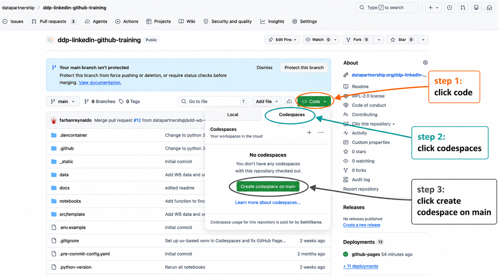
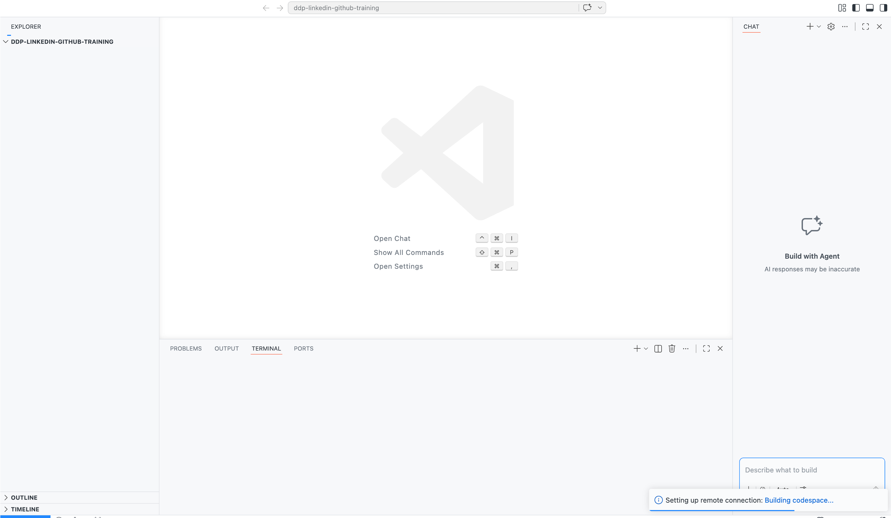
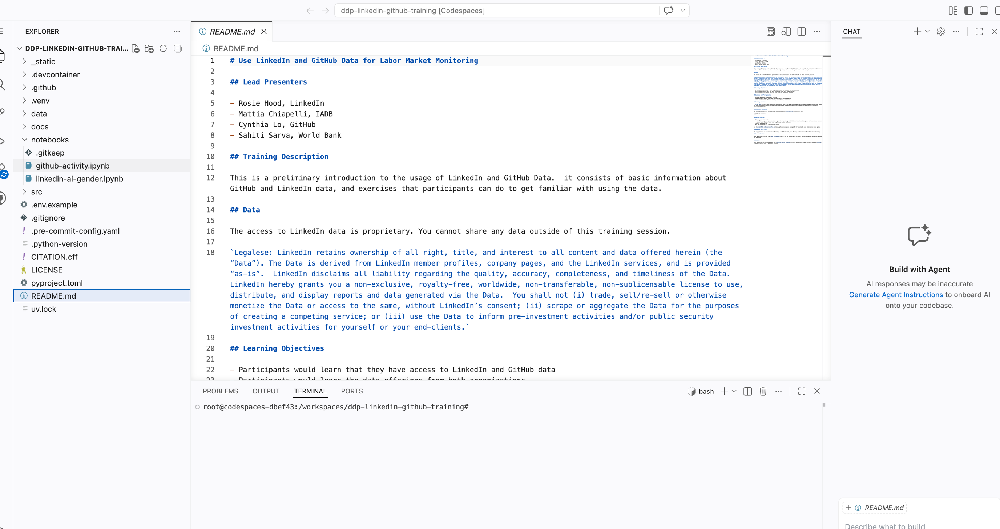
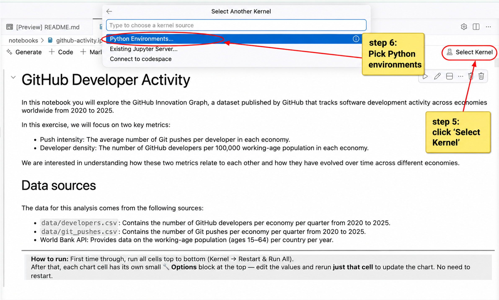
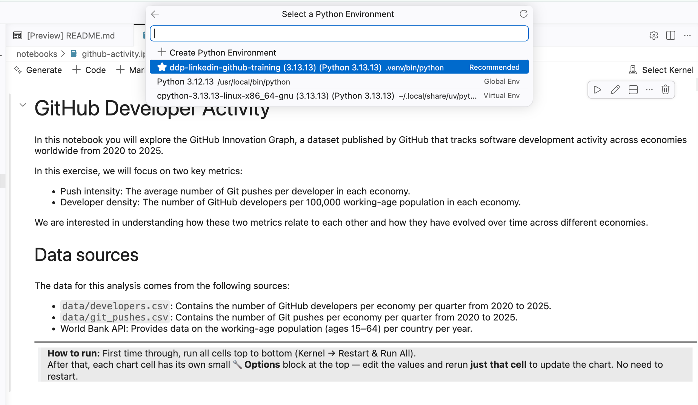
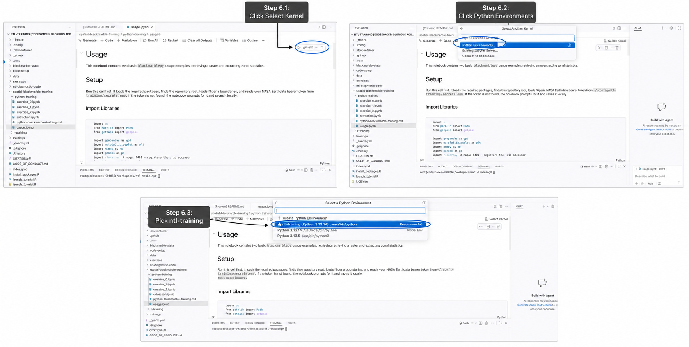

# Steps to use GitHub Codespaces

GitHub Codespaces lets you run the training materials in a browser-based development environment.

## Step 1: Create GitHub

Create a free GitHub account at [github.com](https://github.com/) or sign in to your existing account.

## Step 2: Open training repository

Open the [ntl-training repository](https://github.com/worldbank/ntl-training).

## Step 3: Open Codespaces menu and create a codespace

On the repository page, click the green **Code** button. In the menu that opens, select the **Codespaces** tab, then click **Create codespace on main**.

## Step 4: Open your codespace

GitHub will open the codespace in a browser-based VS Code window. Wait up to 2 minutes for this to complete setup.

## Step 5: Open a notebook

Use the file explorer on the left to open the notebook you want to run.

## Step 6: Select kernel

Click **Select Kernel** in the upper-right corner of the notebook, then choose the available Python kernel.

## Step 7: Run!

Run the notebook cells from top to bottom.
