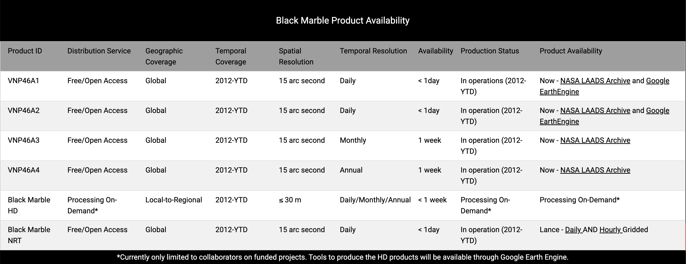
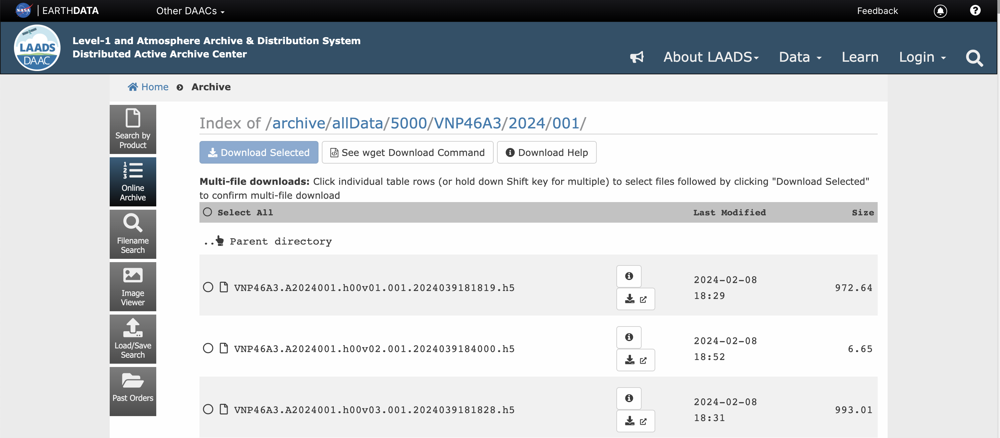

```{r setup, include=FALSE}
library(learnr)
library(tidyverse)
library(sf)
library(terra)
library(geodata)
library(osmdata)
library(leaflet)
library(blackmarbler)
library(tidyterra)
library(exactextractr)
library(here)

tutorial_options(
  exercise.timelimit = 60,
  # A simple checker function that just returns the message in the check chunk
  exercise.checker = function(check_code, ...) {
    list(
      message = eval(parse(text = check_code)),
      correct = logical(0),
      type = "info",
      location = "append"
    )
  }
)
knitr::opts_chunk$set(error = TRUE)
```

## Spatial Data

### Data Types

There are two main types of spatial data: (1) __vector data__ and (2) __raster data__.

|       | Vector Data | Raster Data|
| ----- | ----- | ----- |
| What  | Points, lines, or polygons | Spatially referenced grid |
| Common file formats | Shapefiles (.shp), geojsons (.geojson) | Geotif (.tif), NetCDF files |
| Examples | Polygons of countries, polylines of roads, points of schools | Satellite imagery |

<table>
<tr>
<td style="text-align: center;"><strong>Vector</strong></td>
<td style="text-align: center;"><strong>Raster</strong></td>
</tr>
<tr>
<td style="padding-right: 50px;"></td>
<td style="padding-left: 50px;"></td>
</tr>
</table>


### Coordinate Reference Systems (CRS)

* __Coordinate reference systems (CRS)__ are frameworks that define locations on earth using coordinates.

* For example, the World Bank is at latitude 38.89 and longitude -77.04.


* There are many different coordinate reference systems, which can be grouped into __geographic (or spherical)__ and __projected__ coordinate reference systems. Geographic systems live on a sphere, while projected systems are ``projected'' onto a flat surface.


#### Geographic Coordinate Systems

##### Overview

__Units:__ Defined by latitude and longitude, which measure angles and units are typically in decimal degrees. (Eg, angle is latitude from the equator).

__Latitude & Longitude:__ 

* On a grid X = longitude, Y = latitude; sometimes represented as (longitude, latitude). 
* Also has become convention to report them in alphabetical order: (latitude, longitude) — such as in Google Maps.
* Valid range of latitude: -90 to 90
* Valid range of longitude: -180 to 180
* __{Tip}__ Latitude sounds (and looks!) like latter


##### Distance on a sphere

* At the equator (latitude = 0), a 1 decimal degree longitude distance is about 111km; towards the poles (latitude = -90 or 90), a 1 decimal degree longitude distance converges to 0 km. 
* We must be careful (ie, use algorithms that account for a spherical earth) to calculate distances! The distance along a sphere is referred to as a [great circle distance](https://en.wikipedia.org/wiki/Great-circle_distance).
* Multiple options for spherical distance calculations, with trade-off between accuracy & complexity. (See distance section for details).

<table>
<tr>
<td style="padding-right: 50px;"></td>
<td style="padding-left: 50px;"></td>
</tr>
</table>

##### Datums

* __Is the earth flat?__ No!
* __Is the earth a sphere?__ No!
* __Is the earth a lumpy ellipsoid?__ [Yes!](https://oceanservice.noaa.gov/facts/earth-round.html#:~:text=The%20Earth%20is%20an%20irregularly%20shaped%20ellipsoid.&text=While%20the%20Earth%20appears%20to,unique%20and%20ever%2Dchanging%20shape.)

The earth is a lumpy ellipsoid, a bit flattened at the poles. 

* A [datum](https://www.maptoaster.com/maptoaster-topo-nz/articles/projection/datum-projection.html) is a model of the earth that is used in mapping. One of the most common datums is [WGS 84](https://en.wikipedia.org/wiki/World_Geodetic_System), which is used by the Global Positional System (GPS). 
* A datum is a reference ellipsoid that approximates the shape of the earth.
* Other datums exist, and the latitude and longitude values for a specific location will be different depending on the datum.

<table>
<tr>
<td style="padding-right: 50px;"></td>
<td style="padding-left: 50px;"></td>
</tr>
</table>

#### Projected Coordinate Systems

Projected coordinate systems project spatial data from a 3D to 2D surface.

__Distortions:__ Projections will distort some combination of distance, area, shape or direction. Different projections can minimize distorting some aspect at the expense of others. 

__Units:__ When projected, points are represented as _northings_ and _eastings._ Values are often represented in meters, where northings/eastings are the meter distance from some reference point. Consequently, values can be very large!

__Datums still relevant:__ Projections start from some representation of the earth. Many projections (eg, [UTM](https://en.wikipedia.org/wiki/Universal_Transverse_Mercator_coordinate_system)) use the WGS84 datum as a starting point (ie, reference datum), then project it onto a flat surface. 

<table>
<tr>
<td style="text-align: center;">
<strong><a href="https://www.youtube.com/watch?v=eLqC3FNNOaI" target="_blank">Click here to see why Toby looks so confused</a></strong>
</td>
<td style="text-align: center;"><strong>Different Projections</strong></td>
</tr>
<tr>
<td style="padding-right: 50px;"></td>
<td style="padding-left: 50px;"></td>
</tr>
</table>

#### Referencing Coordinate Reference Systems

* There are many ways to reference coordinate systems, some of which are verbose. 
* __PROJ__ (Library for projections) way of referencing WGS84 `+proj=longlat +datum=WGS84 +no_defs +type=crs`
* __[EPSG](https://epsg.io/)__ Assigns numeric code to CRSs to make it easier to reference. Here, WGS84 is `4326`. 

#### CRS as Units

Whenever have spatial data, need to know which coordinate reference system (CRS) the data is in.

* You wouldn’t say __“I am 5 away”__
* You would say __“I am 5 [miles / kilometers / minutes / hours] away”__ (units!)
* Similarly, a “complete” way to describe location would be: I am at __6.51 latitude, 3.52 longitude using the WGS 84 CRS__

#### Quiz

Explain what's going on here.

{width=50%}

## Spatial Analysis in R

### Packages for spatial data

There are many packages for working with spatial data. Below summarizes some of the most commonly used packages for spatial analysis.

* [sf](https://r-spatial.github.io/sf/): Package for working with vector data. (sf = simple features)
* [terra](https://rspatial.github.io/terra/): Package for working with both raster data and vector data.
* [tidyterra](https://dieghernan.github.io/tidyterra/): Provides methods common to tidyverse for working with terra objects; also provides additional geoms for plotting spatial data using `ggplot`
* [leaflet](https://rstudio.github.io/leaflet/) R interface to leaflet, a JavaScript library for interactive maps

:::{.callout-note}
Before `sf`, the `sp` package was used; before `terra`, the `raster` package was used. When googling/asking AI about spatial data analysis in R, you may come across these packages. Answers using these packages may be out of date. In particular, the `sp` package handles spatial data notably different than `sf`. 

* `sp` objects are similar to `shapefiles`; a shapefile isn't one file, it's a collection of files---one file contains the geometries (shapes), another contains the CRS, another contains the data, etc. Similarly, `sp` files were a list---one item of the list contained the geometries (shapes), another item contained the CRS, etc. 

* `sf` objects are set up more similar to `geojsons`, where each row of the dataframe has a geometry column.
:::

### Spherical Geometry in s2 

Often, spatial data comes in the WGS 84 CRS (EPSG:4326). This is a geographic/spherical coordinate reference system where the unit of analysis is decimal degrees. __The `sf` package makes it easy to compute distances and areas in terms of meters, taking into account the curvature of the earth.__ For this, `sf` relies on the [s2](http://s2geometry.io/about/overview) library developed by Google which facilitates quickly computing distances and areas. 

The s2 library uses a system of spatial grids and relies on great circle distance formula for distance calculations; for more information, see [here](http://s2geometry.io/about/overview). While the sf package uses s2 by default, it can be turned off using `sf_use_s2(false)` (but use caution when doing so).

:::{.callout-note}
Instead of relying on s2, there are two other common ways of computing distances/areas.

* __Project data:__ One approach is to project the data, so that the data is represented on a 2-dimensional surface and where the units are something like meters (meters are a common unit for projected CRS, but not always used; some US projected CRSs use feet). When projected, we can rely on standard formula for calculating distances/areas---such as the distance formula for distances. However, this approach requires picking a projected CRS that is accurate for the location.

* __Spherical Trigonometry:__ One approach to stay on a geographic CRS and use more advanced equations that account for being on a sphere. For example, for calculating distances, a number of [great circle distance](https://en.wikipedia.org/wiki/Great-circle_distance#:~:text=The%20great%2Dcircle%20distance%2C%20orthodromic,the%20surface%20of%20the%20sphere.) formulas exist---such as the [Haversine Formula](https://en.wikipedia.org/wiki/Haversine_formula), [Vincenty's Formula](https://en.wikipedia.org/wiki/Vincenty%27s_formulae), etc. The [geosphere](https://github.com/rspatial/geosphere) package facilitates using these. However, these formula can be slow to implement for large numbers of observations. The `s2` library does rely on these formula; however, it uses them in combination with other methods.
:::

## Vector Data: Basics

:::{.callout-note}
__Summary of functions__

* `st_as_sf()`: Convert dataframe to sf object
* `read_sf()`: Read spatial file
* `st_crs()`: Check CRS
* `st_geometry_type()`: Check geometry type
* `st_area()`: Determine area of polygon
* `st_length()`: Determine length of polyline
:::

### Points

Here we load a csv file that has latitude and longitude information. We can convert this to a spatial file using the `st_as_sf()` function. We know from the data metadata that the data is in ESPG:4326

```{r}
gf_df <- read_csv(here("data", "gas_flaring", "finaldata", "gas_flaring_nga.csv"))

head(gf_df)
```

```{r}
gf_sf <- gf_df %>%
  st_as_sf(coords = c("longitude", "latitude"),
           crs = 4326)

head(gf_sf)
```

### Polygons & Polylines

* geom_sf(): Used with ggplot(); plot sf objects

__Load data__
```{r}
adm1_sf <- read_sf(here("data", "gadm", "nga_adm1.geojson"), quiet = T)
```

__Functions that work on dataframes to explore data work on sf objects__
```{r}
# Examine first few observations
print(head(adm1_sf))

# Examine first few observations
head(adm1_sf)

# Number of rows
nrow(adm1_sf)

# Filter
adm1_sf %>%
  filter(NAME_1 == "Lagos")
```

__sf specific functions__
```{r}
# Check coordinate reference system
st_crs(adm1_sf)

# Check geometry type
st_geometry_type(adm1_sf) %>% head()
```

__Area is not a variable, but we can calculate it__
```{r}
# Calculate area
st_area(adm1_sf)

# Add as variable
# (as.numeric removes the units)
adm1_sf <- adm1_sf %>%
  mutate(area_m2 = geometry %>% st_area() %>% as.numeric())
```

__Exercise: Check the CRS & geometry type__
```{r ex_vector_basics_1, exercise = T}
roads_sf <- read_sf(here("data", "osm", "roads_nga_main.geojson"), quiet = T)

```

__Exercise: Add the road length as a variable in `roads_sf`__
```{r ex_vector_basics_2, exercise = T}
roads_sf <- read_sf(here("data", "osm", "roads_nga_main.geojson"), quiet = T)

```

## Vector Data: Mapping

### Static Maps

__Static plot using geom_sf__

#### Simple
```{r}
ggplot() +
  geom_sf(data = adm1_sf)
```

```{r}
roads_sf <- read_sf(here("data", "osm", "roads_nga_main.geojson"), quiet = T)

ggplot() +
  geom_sf(data = adm1_sf) +
  geom_sf(data = roads_sf) +
  geom_sf(data = gf_sf)
```

#### Fill by Area
```{r}
ggplot() +
  geom_sf(data = adm1_sf, 
          aes(fill = area_m2),
          color = "black") +
  scale_fill_distiller(palette = "YlGnBu", 
                       direction = -1) + 
  labs(fill = "Area",
       title = "Area of Nairobi's ADM2s") +
  theme_void() +
  theme(legend.position = c(0.9, 0.2),
        plot.title = element_text(face = "bold"))
```

### Interactive Maps

We use the `leaflet` package to make interactive maps. [Leaflet](https://leafletjs.com/) is a JavaScript library, but the `leaflet` R package allows making interactive maps using R. Use of leaflet somewhat mimics how we use ggplot.

* Start with `leaflet()` (instead of `ggplot()`)
* Add spatial layers, defining type of layer (similar to geometries)

:::{.callout-note}
We can spent lots of time going over what we can done with leaflet - but that would take up too much time. [This resource](https://rstudio.github.io/leaflet/articles/colors.html) provides helpful tutorials for things like:

* Changing the basemap 
* Adding colors
* Adding a legend
* And much more!
:::

__Basic Map__

```{r}
leaflet() %>%
  addTiles() %>% # Basemap
  addPolygons(data = adm1_sf)
```


__Add Multiple Layers__

```{r}
trunk_sf <- roads_sf %>%
  filter(highway == "trunk")

leaflet() %>%
  addTiles() %>% 
  addPolygons(data = adm1_sf, fillOpacity = 0.1) %>%
  addPolylines(data = road_sf, color = "black") %>%
  addCircles(data = gf_sf, color = "red")
```

## Vector Data: Spatial Operations on 1 Dataset

* `st_buffer()`: Buffer point/line/polygon
* `st_union()`: Dissolve by attribute (resolving boundaries)
* `st_combine()`: Dissolve by attribute (without resolving boundaries). Faster than `st_union()`, but can lead to issues.
* `st_transform()`: Transform CRS
* `st_centroid()`: Create new sf object that uses the centroid
* `st_drop_geometry()`: Drop geometry; convert from sf to dataframe
* `st_bbox()`: Get bounding box

### Buffer

```{r}
gf_5km_sf <- gf_sf %>% st_buffer(dist = 5000)
```

### Combine/Union

```{r}
adm2_sf <- read_sf(here("data", "gadm", "nga_adm2.geojson"), quiet = T)

adm1_combine_sf <- adm2_sf %>% 
  group_by(NAME_1) %>%
  summarise(geometry = st_combine(geometry)) %>%
  ungroup()

adm1_union_sf <- adm2_sf %>% 
  group_by(NAME_1) %>%
  summarise(geometry = st_union(geometry)) %>%
  ungroup()

nrow(adm1_combine_sf)
nrow(adm1_union_sf)

ggplot() +
  geom_sf(data = adm1_combine_sf, aes(color = "Using: st_combine()"), fill = NA) +
  geom_sf(data = adm1_union_sf, aes(color = "Using: st_union()"), fill = NA)
```

### Other functions

```{r otherfunctions1, exercise = T}
adm2_proj_sf  <- adm2_sf %>% st_transform(crs = 2311)
adm2_point_sf <- adm2_sf %>% st_centroid()
adm2_df       <- adm2_sf %>% st_drop_geometry()
adm2_bbox     <- adm2_sf %>% st_bbox()
```

## Vector Data: Spatial Operations on 2+ Datasets

* `st_intersects()`: Indicates whether simple features intersect (returns TRUE/FALSE).
* `st_intersection()`: Cut one spatial object based on another (returns spatial object).
* `st_difference()`: Remove part of spatial object based on another.  
* `st_distance()`: Calculate distances.
* `st_join()`: Spatial join (ie, add attributes of one dataframe to another based on location). 

### Intersects
```{r}
roads_sf <- read_sf(here("data", "osm", "roads_nga_main.geojson"), quiet = T)

# Matrix of T/F. apply(1, max) shows if adm1_sf intersects with any major roads
st_intersects(adm1_sf, roads_sf, sparse = F) %>% apply(1, max)
```

### Intersection
```{r}
delta_sf <- adm1_sf %>% filter(NAME_1 == "Delta")
gf_delta_sf <- st_intersection(gf_sf, delta_sf)

ggplot() +
  geom_sf(data = delta_sf, color = "red") +
  geom_sf(data = gf_delta_sf)
```

### Difference
```{r}
gf_notdelta_sf <- st_difference(gf_sf, delta_sf)

ggplot() +
  geom_sf(data = delta_sf, color = "red") +
  geom_sf(data = gf_notdelta_sf)
```

### Other Functions
```{r otherfunctions2, exercise = T}
gf_adminfo_sf    <- st_join(gf_sf, adm1_sf)
adm1_sf$dist_gf_m <- st_distance(adm1_sf, gf_sf) %>% apply(1, min)
```

## Raster Data

_1 Band_
```{r}
ntl_r <- rast(file.path(here("data", "ntl_blackmarble", "nigeria",
                             "VNP46A4_NearNadir_Composite_Snow_Free_qflag_t2024.tif")))

ntl_r
```

_Multiple bands_ in individual tif
```{r}
ntl_m_r <- rast(file.path(here("data", "ntl_blackmarble", "nigeria",
                               "VNP46A4_all.tif")))

ntl_m_r
```

_Multiple bands_ Load multiple bands from multiple tif files
```{r}
ntl_m_r <- file.path(here("data", "ntl_blackmarble", "nigeria")) %>%
  list.files(full.names = T,
             pattern = "*.tif") %>%
  str_subset("VNP46A4") %>% # Annual files
  str_subset("20") %>% # Individual annual files (2012, 2013, etc)
  rast()

ntl_m_r

ntl_m_r[[1]]
```

### Raster Algebrea

```{r}
ntl_p1_r   <- ntl_r + 1            # Add
ntl_t5_r   <- ntl_r * 5            # Multiply
ntl_bin_r  <- ntl_r >= 10          # Make binary

ntl_log_r  <- log(ntl_r)           # Log
ntl_log_r[ntl_log_r == -Inf] <- NA # Replace values (Log of 0 is -Inf)

ntl_m_log_r  <- log(ntl_m_r)           # Log
ntl_m_log_r[ntl_m_log_r == -Inf] <- NA # Replace values (Log of 0 is -Inf)

ntl_mean_r <- (ntl_m_r[[1]] + ntl_m_r[[2]])/2 # Add and divide
```

### Static Maps

__Simple Plot__

```{r}
plot(ntl_log_r)
```

__Simple Plot__

```{r}
plot(ntl_m_log_r)
```

__Using ggplot__

We use `ggplot` and the `tidyterra` package, which brings `geom_spatraster` for plotting rasters

```{r}
ggplot() +
  geom_spatraster(data = ntl_r) +
  scale_fill_distiller(palette = "YlOrRd",
                       na.value = "black",
                       trans = "log" ) +
  labs(fill = "Radiance") +
  theme_void()
```

### Interactive Maps

In `leaflet()`, we can use `addRasterImage()` to plot raster files.

```{r}
pal <- colorNumeric("YlOrRd", values(ntl_log_r), na.color = "transparent")

leaflet() %>%
  addTiles() %>%
  addRasterImage(ntl_log_r, colors = pal, opacity = 0.8)
```

### Cropping & Masking with Polygon

* `crop()`: Restricts raster to bounding box of polygon
* `mask()`: Sets values to `NA` that are outside of the polygon
* `mask(inverse = T)`: Sets values to `NA` that are _inside_ of the polygon

__Crop__
```{r crop, exercise = T}
adm0_sf <- read_sf(here("data", "gadm", "nga_adm0.geojson"), quiet = T)
ntl_r <- rast(file.path(here("data", "ntl_blackmarble", "nigeria",
                             "VNP46A4_NearNadir_Composite_Snow_Free_qflag_t2024.tif")))

ntl_crop_r <- crop(ntl_r, adm0_sf)

plot(ntl_log_crop_r)
```

__Mask__
```{r mask, exercise = T}
adm0_sf <- read_sf(here("data", "gadm", "nga_adm0.geojson"), quiet = T)
ntl_r <- rast(file.path(here("data", "ntl_blackmarble", "nigeria",
                             "VNP46A4_NearNadir_Composite_Snow_Free_qflag_t2024.tif")))

ntl_mask_r <- mask(ntl_log_r, adm0_sf)

plot(ntl_log_mask_r)
```

__Mask, Inverse__
```{r mask_inv, exercise = T}
adm0_sf <- read_sf(here("data", "gadm", "nga_adm0.geojson"), quiet = T)
ntl_r <- rast(file.path(here("data", "ntl_blackmarble", "nigeria",
                             "VNP46A4_NearNadir_Composite_Snow_Free_qflag_t2024.tif")))

ntl_mask_inv_r <- mask(ntl_log_r, adm0_sf, inverse = T)

plot(ntl_mask_inv_r)
```

### Zonal Statistics

__Using [terra::extract](https://rspatial.github.io/terra/reference/extract.html)__
```{r}
adm1_sf$ntl_v1 <- terra::extract(ntl_r, adm1_sf, fun = "sum")$t2024 
```

__Using [exactextractr::exact_extract]()__
```{r}
adm1_sf$ntl_v2 <- exact_extract(ntl_r, adm1_sf, fun = "sum", progress = F)

head(adm1_sf)
```

__Multiple stats__
```{r}
ntl_stat_df <- exact_extract(ntl_r, adm1_sf, 
                             fun = c("sum",
                                     "max",
                                     "quantile"), 
                             quantiles = c(0.05, 0.95),
                             progress = F)

head(ntl_stat_df)
```

__Raster stack__
```{r}
ntl_m_df <- exact_extract(ntl_m_r, adm1_sf, fun = "sum", progress = F)

head(ntl_m_df)
```

__Exercise: Make a map of the sum of NTL at the ADM 2 level__
```{r ntl_map_1, exercise = T}
adm2_sf <- read_sf(here("data", "gadm", "nga_adm2.geojson"), quiet = T)
ntl_r <- rast(file.path(here("data", "ntl_blackmarble", "nigeria",
                             "VNP46A4_NearNadir_Composite_Snow_Free_qflag_t2024.tif")))


```

<details>
 <summary style="color: blue; text-decoration: underline; cursor: pointer;">
    Click to see solution
  </summary>
```{r}
adm2_sf <- read_sf(here("data", "gadm", "nga_adm2.geojson"), quiet = T)
ntl_r <- rast(file.path(here("data", "ntl_blackmarble", "nigeria",
                             "VNP46A4_NearNadir_Composite_Snow_Free_qflag_t2024.tif")))

adm2_sf$ntl_sum <- exact_extract(ntl_r, adm2_sf, fun = "sum", progress = F)

ggplot() +
  geom_sf(data = adm2_sf,
          aes(fill = log(ntl_sum+1)),
          color = NA) +
  labs(fill = "Log Radiance") +
  scale_fill_viridis_c(option = "magma") +
  theme_void()
```
</details>

## BlackMarbleR: Overview

__Black Marble Products__

The BlackMarbleR package facilitates retrieving and working with nighttime lights data from [NASA Black Marble](https://blackmarble.gsfc.nasa.gov/). Black Marble produces a number of nighttime light products, from daily, monthly, to annual composites.

{width=75%}

__Why BlackMarbleR?__

The above image notes that produces are available via the NASA LAADS Archive. Within the archive, raw nighttime lights data are separated by (1) time and (2) tile. The below image shows a screenshot from the archive---showing raw files for January 2024.

{width=75%}

In some cases, our region of interest to examine nighttime lights crosses multiple tiles. For example, 4 tiles comprise Nigeria Consequently, to examine annual trends in nighttime lights for Kenya, for each year we'd need to download 4 tiles and mosaic them together. Doing this manually can be time consuming. The `BlackMarbleR` package does this all for us.

### Package overview

The [documentation](https://github.com/worldbank/blackmarbler) for BlackMarbleR contains more extended documentation. This section provides a brief overview of functions and key inputs. 

__Functions__

The `blackmarbler` package contains two main functions:

* `bm_raster` For retrieving rasters of nighttime lights for a given region of interest
* `bm_extract` For retrieving zonal statistics (sum, mean, etc) of nighttime lights for a given region of interest.

__Required arguments__

Below are the main, required arguments to the functions:

* `roi_sf`: sf object defining region of interest (sf polygon)
* `product_id`: Black Marble product ID
- `"VNP46A1"`: Daily (raw)
- `"VNP46A2"`: Daily (corrected)
- `"VNP46A3"`: Monthly
- `"VNP46A4"`: Annual
* `date`: Date to query (can be one or multiple dates).
* `bearer`: NASA bearer token. For instructions on how to create a token, see [here](https://github.com/worldbank/blackmarbler#bearer-token-).

__Additional arguments__

Below are select optional arguments; for all arguments, see documentation [here](https://github.com/worldbank/blackmarbler).

* `variable`: The variable to use for nighttime lights. For monthly and annual data (`VNP46A3` and `VNP46A4`) the default is `"NearNadir_Composite_Snow_Free"`. 
* `quality_flag_rm`: Quality flag used to set values to `NA`. For examples using the quality variable, see [here](https://worldbank.github.io/blackmarbler/articles/assess-quality.html).
* `output_location_type`: Either `"r_memory"` or `"file"`. 
- `"r_memory"`: Data is only load into R memory.
- `"file"`: File (raster or dataframe) is saved locally; data is also load into R memory.
* `file_dir`: When `output_location_type = "file"`, the directory where to save the data.
* `aggregation_fun`: For `bm_extract`, a vector of functions to aggregate data (default: `"mean"`).

### Usage

__bm_raster()__

```{r usage1, exercise = T}

# Load ADM
adm0_sf <- read_sf(here("data", "gadm", "nga_adm0.geojson"), quiet = T)

# Raster, where gap filled removed
ntl_r <- bm_raster(
  roi_sf = nga_1_sf,
  product_id = "VNP46A3",
  date = "2024-01-01",
  bearer = bearer,
  output_location_type = "file",
  file_dir = file.path(here("data", "ntl_blackmarble", "nigeria"))
)

plot(adm0_sf)
```

__bm_extract()__

```{r usage1, exercise = T}

# Load ADM
adm1_sf <- read_sf(here("data", "gadm", "nga_adm1.geojson"), quiet = T)

# Raster, where gap filled removed
ntl_df <- bm_extract(
  roi_sf = adm1_sf,
  product_id = "VNP46A4",
  date = 2012:2024,
  bearer = bearer,
  output_location_type = "file",
  file_dir = file.path(here("data", "ntl_blackmarble", "nigeria")),
  aggregation_fun = "sum"
)

head(ntl_df)
```

## BlackMarbleR: Exercise 1 [Quality Check]

__Exercise:__ Create a raster of NTL for January 2024, removing gap filled pixels. Calculate the proportion of non-NA pixels in each ADM2.
```{r qualitycheck, exercise = T}

# Load ADM
adm2_sf <- read_sf(here("data", "gadm", "nga_adm2.geojson"), quiet = T)

# Raster, where gap filled removed
ntl_r <- bm_raster(
  roi_sf = nga_1_sf,
  product_id = "VNP46A3",
  date = "2024-01-01",
  bearer = bearer,
  output_location_type = "file",
  file_dir = file.path(here("data", "ntl_blackmarble", "nigeria")),
  variable = "NearNadir_Composite_Snow_Free",
  quality_flag_rm = 2
)

# All non-NA pixels = 1
ntl_r[!is.na(ntl_r)] <- 1
ntl_r[is.na(ntl_r)] <- 0
```

## BlackMarbleR: Exercise 2 [NTL in/excluding gas flaring]

## BlackMarbleR: Exercise 3 [Hurricane Maria]

