```{r setup, include=FALSE}
library(learnr)
library(tidyverse)
library(sf)
library(terra)
library(geodata)
library(osmdata)
library(leaflet)
library(blackmarbler)
library(here)

tutorial_options(
  exercise.timelimit = 60,
  # A simple checker function that just returns the message in the check chunk
  exercise.checker = function(check_code, ...) {
    list(
      message = eval(parse(text = check_code)),
      correct = logical(0),
      type = "info",
      location = "append"
    )
  }
)
knitr::opts_chunk$set(error = TRUE)
```

## Spatial Data

### Data Types

There are two main types of spatial data: (1) __vector data__ and (2) __raster data__.

|       | Vector Data | Raster Data|
| ----- | ----- | ----- |
| What  | Points, lines, or polygons | Spatially referenced grid |
| Common file formats | Shapefiles (.shp), geojsons (.geojson) | Geotif (.tif), NetCDF files |
| Examples | Polygons of countries, polylines of roads, points of schools | Satellite imagery |

<table>
<tr>
<td style="text-align: center;"><strong>Vector</strong></td>
<td style="text-align: center;"><strong>Raster</strong></td>
</tr>
<tr>
<td style="padding-right: 50px;">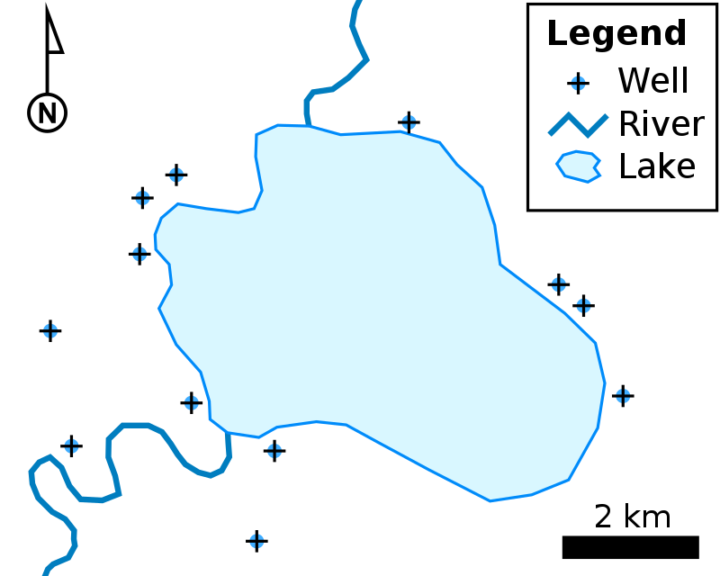</td>
<td style="padding-left: 50px;">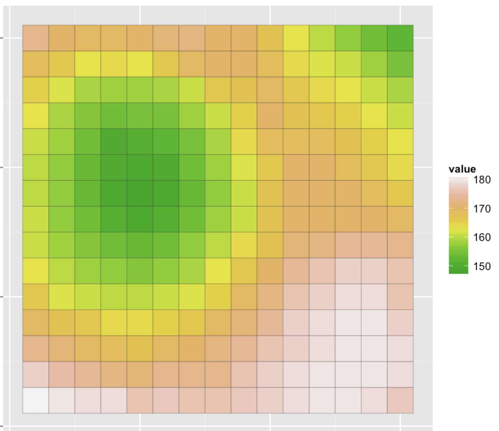</td>
</tr>
</table>


### Coordinate Reference Systems (CRS)

* __Coordinate reference systems (CRS)__ are frameworks that define locations on earth using coordinates.

* For example, the World Bank is at latitude 38.89 and longitude -77.04.

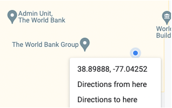


* There are many different coordinate reference systems, which can be grouped into __geographic (or spherical)__ and __projected__ coordinate reference systems. Geographic systems live on a sphere, while projected systems are ``projected'' onto a flat surface.

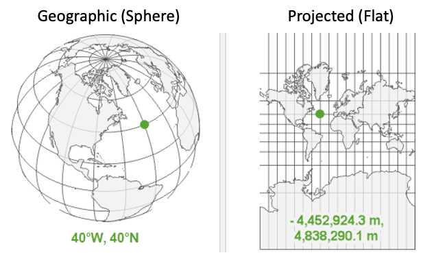

#### Geographic Coordinate Systems

##### Overview

__Units:__ Defined by latitude and longitude, which measure angles and units are typically in decimal degrees. (Eg, angle is latitude from the equator).

__Latitude & Longitude:__ 

* On a grid X = longitude, Y = latitude; sometimes represented as (longitude, latitude). 
* Also has become convention to report them in alphabetical order: (latitude, longitude) — such as in Google Maps.
* Valid range of latitude: -90 to 90
* Valid range of longitude: -180 to 180
* __{Tip}__ Latitude sounds (and looks!) like latter

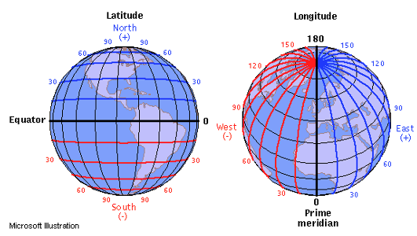

##### Distance on a sphere

* At the equator (latitude = 0), a 1 decimal degree longitude distance is about 111km; towards the poles (latitude = -90 or 90), a 1 decimal degree longitude distance converges to 0 km. 
* We must be careful (ie, use algorithms that account for a spherical earth) to calculate distances! The distance along a sphere is referred to as a [great circle distance](https://en.wikipedia.org/wiki/Great-circle_distance).
* Multiple options for spherical distance calculations, with trade-off between accuracy & complexity. (See distance section for details).

<table>
<tr>
<td style="padding-right: 50px;">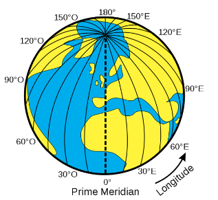</td>
<td style="padding-left: 50px;">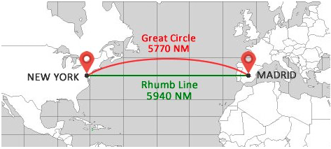</td>
</tr>
</table>

##### Datums

* __Is the earth flat?__ No!
* __Is the earth a sphere?__ No!
* __Is the earth a lumpy ellipsoid?__ [Yes!](https://oceanservice.noaa.gov/facts/earth-round.html#:~:text=The%20Earth%20is%20an%20irregularly%20shaped%20ellipsoid.&text=While%20the%20Earth%20appears%20to,unique%20and%20ever%2Dchanging%20shape.)

The earth is a lumpy ellipsoid, a bit flattened at the poles. 

* A [datum](https://www.maptoaster.com/maptoaster-topo-nz/articles/projection/datum-projection.html) is a model of the earth that is used in mapping. One of the most common datums is [WGS 84](https://en.wikipedia.org/wiki/World_Geodetic_System), which is used by the Global Positional System (GPS). 
* A datum is a reference ellipsoid that approximates the shape of the earth.
* Other datums exist, and the latitude and longitude values for a specific location will be different depending on the datum.

<table>
<tr>
<td style="padding-right: 50px;">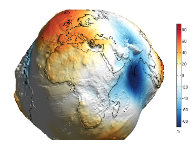</td>
<td style="padding-left: 50px;">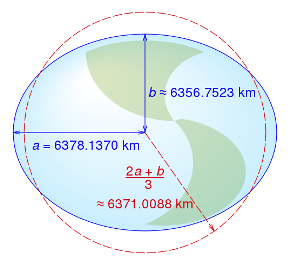</td>
</tr>
</table>

#### Projected Coordinate Systems

Projected coordinate systems project spatial data from a 3D to 2D surface.

__Distortions:__ Projections will distort some combination of distance, area, shape or direction. Different projections can minimize distorting some aspect at the expense of others. 

__Units:__ When projected, points are represented as _northings_ and _eastings._ Values are often represented in meters, where northings/eastings are the meter distance from some reference point. Consequently, values can be very large!

__Datums still relevant:__ Projections start from some representation of the earth. Many projections (eg, [UTM](https://en.wikipedia.org/wiki/Universal_Transverse_Mercator_coordinate_system)) use the WGS84 datum as a starting point (ie, reference datum), then project it onto a flat surface. 

<table>
<tr>
<td style="text-align: center;">
<strong><a href="https://www.youtube.com/watch?v=eLqC3FNNOaI" target="_blank">Click here to see why Toby looks so confused</a></strong>
</td>
<td style="text-align: center;"><strong>Different Projections</strong></td>
</tr>
<tr>
<td style="padding-right: 50px;"></td>
<td style="padding-left: 50px;">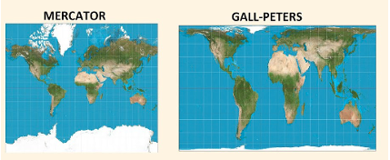</td>
</tr>
</table>

#### Referencing Coordinate Reference Systems

* There are many ways to reference coordinate systems, some of which are verbose. 
* __PROJ__ (Library for projections) way of referencing WGS84 `+proj=longlat +datum=WGS84 +no_defs +type=crs`
* __[EPSG](https://epsg.io/)__ Assigns numeric code to CRSs to make it easier to reference. Here, WGS84 is `4326`. 

#### CRS as Units

Whenever have spatial data, need to know which coordinate reference system (CRS) the data is in.

* You wouldn’t say __“I am 5 away”__
* You would say __“I am 5 [miles / kilometers / minutes / hours] away”__ (units!)
* Similarly, a “complete” way to describe location would be: I am at __6.51 latitude, 3.52 longitude using the WGS 84 CRS__

#### Quiz

Explain what's going on here.

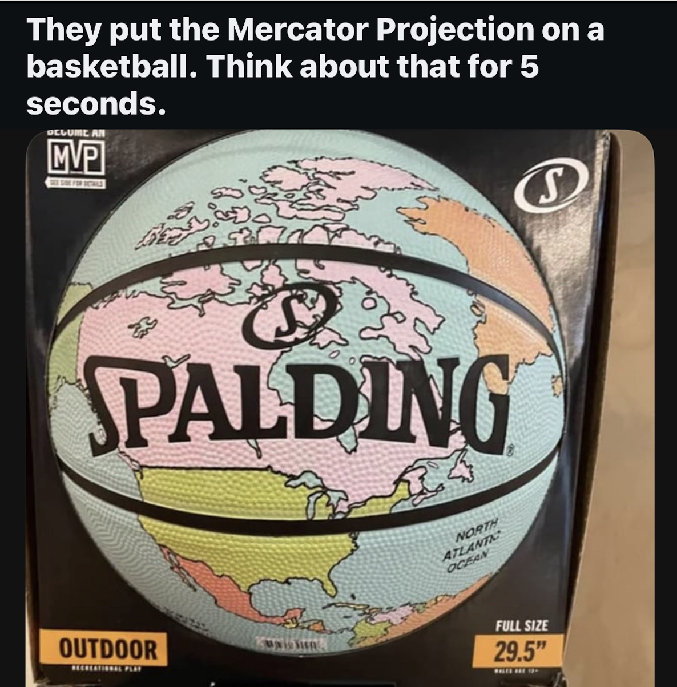{width=50%}

## Spatial Analysis in R

### Packages for spatial data

There are many packages for working with spatial data. Below summarizes some of the most commonly used packages for spatial analysis.

* [sf](https://r-spatial.github.io/sf/): Package for working with vector data. (sf = simple features)
* [terra](https://rspatial.github.io/terra/): Package for working with both raster data and vector data.
* [tidyterra](https://dieghernan.github.io/tidyterra/): Provides methods common to tidyverse for working with terra objects; also provides additional geoms for plotting spatial data using `ggplot`
* [leaflet](https://rstudio.github.io/leaflet/) R interface to leaflet, a JavaScript library for interactive maps

:::{.callout-note}
Before `sf`, the `sp` package was used; before `terra`, the `raster` package was used. When googling/asking AI about spatial data analysis in R, you may come across these packages. Answers using these packages may be out of date. In particular, the `sp` package handles spatial data notably different than `sf`. 

* `sp` objects are similar to `shapefiles`; a shapefile isn't one file, it's a collection of files---one file contains the geometries (shapes), another contains the CRS, another contains the data, etc. Similarly, `sp` files were a list---one item of the list contained the geometries (shapes), another item contained the CRS, etc. 

* `sf` objects are set up more similar to `geojsons`, where each row of the dataframe has a geometry column.
:::

### Spherical Geometry in s2 

Often, spatial data comes in the WGS 84 CRS (EPSG:4326). This is a geographic/spherical coordinate reference system where the unit of analysis is decimal degrees. __The `sf` package makes it easy to compute distances and areas in terms of meters, taking into account the curvature of the earth.__ For this, `sf` relies on the [s2](http://s2geometry.io/about/overview) library developed by Google which facilitates quickly computing distances and areas. 

The s2 library uses a system of spatial grids and relies on great circle distance formula for distance calculations; for more information, see [here](http://s2geometry.io/about/overview). While the sf package uses s2 by default, it can be turned off using `sf_use_s2(false)` (but use caution when doing so).

:::{.callout-note}
Instead of relying on s2, there are two other common ways of computing distances/areas.

* __Project data:__ One approach is to project the data, so that the data is represented on a 2-dimensional surface and where the units are something like meters (meters are a common unit for projected CRS, but not always used; some US projected CRSs use feet). When projected, we can rely on standard formula for calculating distances/areas---such as the distance formula for distances. However, this approach requires picking a projected CRS that is accurate for the location.

* __Spherical Trigonometry:__ One approach to stay on a geographic CRS and use more advanced equations that account for being on a sphere. For example, for calculating distances, a number of [great circle distance](https://en.wikipedia.org/wiki/Great-circle_distance#:~:text=The%20great%2Dcircle%20distance%2C%20orthodromic,the%20surface%20of%20the%20sphere.) formulas exist---such as the [Haversine Formula](https://en.wikipedia.org/wiki/Haversine_formula), [Vincenty's Formula](https://en.wikipedia.org/wiki/Vincenty%27s_formulae), etc. The [geosphere](https://github.com/rspatial/geosphere) package facilitates using these. However, these formula can be slow to implement for large numbers of observations. The `s2` library does rely on these formula; however, it uses them in combination with other methods.
:::

## Vector Data: Basics

:::{.callout-note}
__Summary of functions__

* `st_as_sf()`: Convert dataframe to sf object
* `read_sf()`: Read spatial file
* `st_crs()`: Check CRS
* `st_geometry_type()`: Check geometry type
* `st_area()`: Determine area of polygon
* `st_length()`: Determine length of polyline
:::

### Points

Here we load a csv file that has latitude and longitude information. We can convert this to a spatial file using the `st_as_sf()` function. We know from the data metadata that the data is in ESPG:4326

```{r}
gf_df <- read_csv(here("data", "gas_flaring", "finaldata", "gas_flaring_nga.csv"))

head(gf_df)
```

```{r}
gf_sf <- gf_df %>%
  st_as_sf(coords = c("longitude", "latitude"),
           crs = 4326)

head(gf_sf)
```

### Polygons & Polylines

* geom_sf(): Used with ggplot(); plot sf objects

__Load data__
```{r}
city_sf <- read_sf(here("data", "city.geojson"), quiet = T)
```

__Functions that work on dataframes to explore data work on sf objects__
```{r}
# Examine first few observations
print(head(city_sf))

# Examine first few observations
head(city_sf)

# Number of rows
nrow(city_sf)

# Filter
city_sf %>%
  filter(NAME_2 == "Langata")
```

__sf specific functions__
```{r}
# Check coordinate reference system
st_crs(city_sf)

# Check geometry type
st_geometry_type(city_sf) %>% head()
```

__Area is not a variable, but we can calculate it__
```{r}
# Calculate area
st_area(city_sf)

# Add as variable
# (as.numeric removes the units)
city_sf <- city_sf %>%
  mutate(area_m2 = geometry %>% st_area() %>% as.numeric())
```

__Static plot using geom_sf__

```{r}
ggplot() +
  geom_sf(data = city_sf,
          aes(fill = area_m2))
```

__Exercise: Check the CRS & geometry type__
```{r ex_vector_basics_1, exercise = T}
roads_sf <- read_sf(here("data", "roads.geojson"), quiet = T)

```

__Exercise: Determine length of each road__
```{r ex_vector_basics_2, exercise = T}
roads_sf <- read_sf(here("data", "roads.geojson"), quiet = T)

```

## Vector Data: Mapping

## Vector Data: Spatial Operations

### Spatial Operations on 1 Dataset

### Spatial Operations on > 1 Dataset

## Raster Data

## BlackMarbler

### Overview

### Usage

## BlackMarble Exercises


